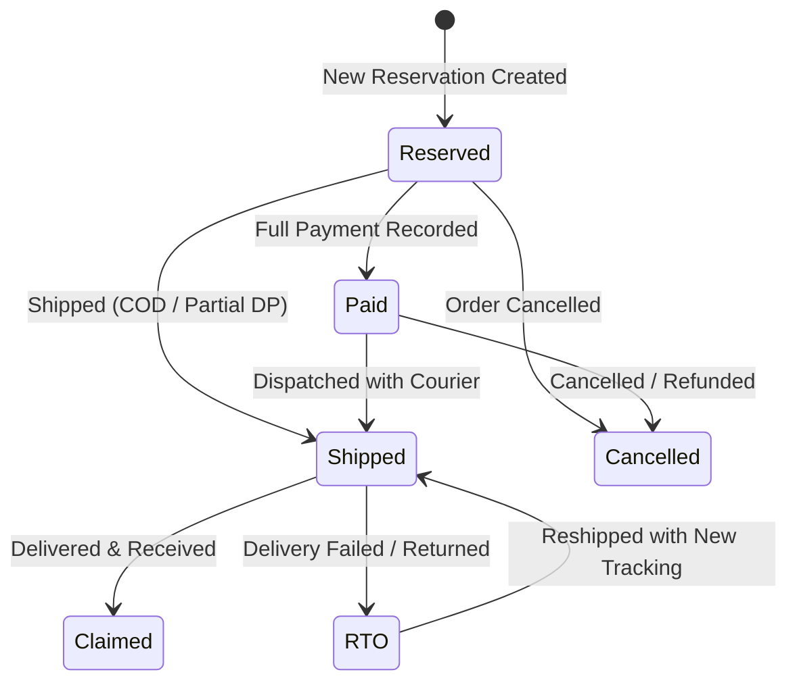

# DAILY PEARLS PH — ORDER MANAGEMENT SYSTEM (OMS)
## Comprehensive User Manual & Operations Guide

---

## Table of Contents
1. [Introduction & System Overview](#1-introduction--system-overview)
2. [User Roles & Permissions Matrix](#2-user-roles--permissions-matrix)
3. [Getting Started & Authentication](#3-getting-started--authentication)
4. [Dashboard & Key Performance Indicators (KPIs)](#4-dashboard--key-performance-indicators-kpis)
5. [Order & Reservation Management](#5-order--reservation-management)
   - 5.1 [Reservation Types (Regular, Pasabuy, COD)](#51-reservation-types)
   - 5.2 [Creating a New Reservation / Order](#52-creating-a-new-reservation--order)
   - 5.3 [Line Items & Moissanite Catalog Selection](#53-line-items--moissanite-catalog-selection)
   - 5.4 [Pricing, Discounts, Shipping, and Downpayments](#54-pricing-discounts-shipping-and-downpayments)
   - 5.5 [Order Lifecycle & Status Progression](#55-order-lifecycle--status-progression)
   - 5.6 [Shipping, Claiming, RTO (Return to Origin), and Reshipping](#56-shipping-claiming-rto-and-reshipping)
   - 5.7 [Cancelling Orders](#57-cancelling-orders)
6. [Payment Processing & Evidence Management](#6-payment-processing--evidence-management)
   - 6.1 [Recording Advance Downpayments and Balance Payments](#61-recording-advance-downpayments-and-balance-payments)
   - 6.2 [Supported Payment Methods](#62-supported-payment-methods)
   - 6.3 [Uploading & Verifying Proof of Payment (Receipts)](#63-uploading--verifying-proof-of-payment-receipts)
7. [Invoicing & Customer Messaging](#7-invoicing--customer-messaging)
   - 7.1 [Digital & Printable Invoices](#71-digital--printable-invoices)
   - 7.2 [One-Click Copy Message Templates (Social Media / Messenger)](#72-one-click-copy-message-templates)
8. [Collections Ledger](#8-collections-ledger)
9. [Moissanite Jewelry Inventory & Sales](#9-moissanite-jewelry-inventory--sales)
   - 9.1 [Moissanite SKU Management](#91-moissanite-sku-management)
   - 9.2 [Sold Moissanite Records](#92-sold-moissanite-records)
10. [Products & Categories Catalog](#10-products--categories-catalog)
11. [Commission & Sales Assistance Tracking](#11-commission--sales-assistance-tracking)
    - 11.1 [Logging Employee Assistance](#111-logging-employee-assistance)
    - 11.2 [Settling & Payouts (Paid / Unpaid)](#112-settling--payouts)
12. [Customer Database](#12-customer-database)
13. [Reports, Analytics & Data Export](#13-reports-analytics--data-export)
14. [User Accounts & System Settings](#14-user-accounts--system-settings)
15. [Troubleshooting & Frequently Asked Questions (FAQ)](#15-troubleshooting--frequently-asked-questions-faq)

---

## 1. Introduction & System Overview

The **Daily Pearls PH Order Management System (OMS)** is an enterprise web application tailored for jewelry, pearls, and custom luxury retail operations. It unifies order processing, reservation handling, multi-channel payment tracking, inventory synchronization, employee commissions, customer relationship management, and financial reporting into an intuitive interface.

### Key Capabilities:
- **Flexible Order Workflows**: Full support for standard inventory sales, custom client requests (*Pasabuy*), and Cash-on-Delivery (*COD*).
- **Line-Item Customization**: Add multiple products per order, link directly to the specialized Moissanite inventory, or enter custom pearl jewelry items manually.
- **Payment & Evidence Tracking**: Track multiple payments per order (Downpayment + Balance), attach proof of payment screenshots, and track remaining balances.
- **Automated Social Selling Tools**: Generate professional customer messages and invoices ready for Facebook Messenger, Viber, WhatsApp, and Instagram DMs with a single click.
- **Employee Commission Ledger**: Attribute sales assistance to team members and manage payouts.
- **Real-Time Financial Reporting**: Monitor monthly sales, net revenue, RTO rates, and export data to CSV/Excel.

---

## 2. User Roles & Permissions Matrix

The system enforces strict Role-Based Access Control (RBAC) to ensure operational security and segregation of duties.

| Feature / Module | Owner | Admin | Staff | Viewer |
| :--- | :---: | :---: | :---: | :---: |
| **Dashboard & Analytics** | Full Access | Full Access | Full Access | Read-Only |
| **Orders & Reservations** | Full (Create/Edit/Delete/Status) | Full (Create/Edit/Delete/Status) | Create / Edit / Ship / Pay | Read-Only |
| **Record Payments & Upload Proof** | Yes | Yes | Yes | Read-Only |
| **Collections Ledger** | Full Access | Full Access | View / Record | Read-Only |
| **Moissanite SKUs & Sold Items** | Full Access | Full Access | View / Link to Orders | Read-Only |
| **Product & Category Catalog** | Full Access | Full Access | Full Access | Read-Only |
| **Commission & Payout Management**| Full Access | Full Access | Restricted | Restricted |
| **Customer Directory** | Full Access | Full Access | Full Access | Read-Only |
| **Financial Reports & CSV Exports**| Full Access | Full Access | View Only | Restricted |
| **User Account Management** | Full Access | Full Access | Restricted | Restricted |
| **System Settings** | Full Access | Full Access | Restricted | Restricted |

---

## 3. Getting Started & Authentication

### 3.1 Logging In
1. Navigate to the application URL in your web browser (e.g., `https://your-domain.com/login` or `http://localhost:3000/login`).
2. Enter your registered **Email Address** and **Password**.
3. Click **Sign In**.
4. Upon authentication, you will be redirected to the **Main Dashboard**.

> [!NOTE]
> Sessions are managed securely via encrypted HTTP-only authentication cookies. If your session expires due to inactivity, simply log in again.

### 3.2 Navigation & Layout
- **Sidebar Navigation**: Located on the left side of the screen. Provides instant access to all primary modules:
  - *Dashboard*, *Orders (All, Reserved, Paid, Shipped, Claimed, RTO, Cancelled)*
  - *Collections*, *Commission*, *Moissanite (SKUs, Sold)*
  - *Products & Categories*, *Customers*, *Reports*, *Accounts*, *Settings*
- **Top Bar**: Displays your logged-in profile, quick actions, and user role.
- **Collapse Mode**: Click the sidebar toggle to collapse the navigation bar and maximize screen space on smaller displays or tablets.

---

## 4. Dashboard & Key Performance Indicators (KPIs)

The Dashboard provides an immediate bird's-eye view of your business health:
- **Total Revenue & Month-to-Date Sales**: Net completed revenue.
- **Order Volume Breakdown**: Number of Active Reservations, Orders Awaiting Payment, In-Transit Packages, and Successfully Claimed Orders.
- **Return to Origin (RTO) Counter**: Quick alert for orders requiring follow-up or reshipment.
- **Recent Activity Feed**: Real-time log of newly created orders, payment recordings, and shipping dispatches.

---

## 5. Order & Reservation Management

### 5.1 Reservation Types
The system categorizes orders into three tailored reservation models:
1. **Regular**: Standard pearl jewelry or catalogue items with scheduled reservation windows and downpayment requirements.
2. **Pasabuy**: Customized sourcing requests or special client procurement where items are ordered on demand.
3. **COD (Cash on Delivery)**: Orders shipped with full balance collected by the delivery courier upon arrival.

---

### 5.2 Creating a New Reservation / Order
To create a new reservation:
1. Navigate to **Orders > Reserved** (or click **New Order** from any orders page).
2. Click the **+ Add Reservation** button.
3. In the modal dialog, enter the **Basic Information**:
   - **FB Name**: Customer's Facebook / Social profile name (essential for live selling & chat identification).
   - **Type**: Select *Regular*, *Pasabuy*, or *COD*.
   - **Invoice Number**: Automatically generated sequentially upon saving.
4. Fill in **Shipping Information**:
   - **Customer Name**: Full legal name for courier waybills.
   - **Phone**: Contact number (e.g., `+63 9xx xxx xxxx`).
   - **Address**: Complete shipping address (Street, Barangay, City, Province, Postal Code).

---

### 5.3 Line Items & Moissanite Catalog Selection
You can add multiple line items to a single reservation:
1. Click **+ Add Item** to add additional lines for bulk customer purchases.
2. For each line, select the **Source**:
   - **Manual Item**: Type the *Item Name*, optional *SKU / Item Code*, *Category*, *Quantity*, and *Unit Price*.
   - **Moissanite Catalog**: Choose directly from the registered Moissanite inventory. The system automatically populates the Item Code, Description, Category, and default Selling Price.
3. The system calculates the individual line totals (`Quantity × Unit Price`) in real time.

---

### 5.4 Pricing, Discounts, Shipping, and Downpayments
1. **Subtotal**: Automatically summed from all valid line items.
2. **Discount**: Enter any agreed voucher or negotiated discount (deducted from subtotal).
3. **Shipping Fee**: Enter courier delivery charges (added to total).
4. **Total Amount / Grand Total**: Calculated as `Subtotal − Discount + Shipping Fee`.
5. **Downpayment (DP)**: Enter initial deposit received.
   - If `DP > 0`, select the **DP Payment Method** (e.g., GCash, BDO, BPI).
6. **Remaining Balance**: Live display showing `Grand Total − Downpayment`.
7. Click **Save Reservation**.

---

### 5.5 Order Lifecycle & Status Progression

#### Status Definitions:
- **Reserved** (`/orders/reserved`): Item is held for the customer awaiting balance payment or dispatch.
- **Paid** (`/orders/paid`): Order is 100% paid and ready for packing and dispatch.
- **Shipped** (`/orders/shipped`): Package is handed over to the courier with tracking information.
- **Claimed** (`/orders/claimed`): Successfully received and accepted by the customer.
- **RTO (Return to Origin)** (`/orders/rto`): Delivery failed (e.g., uncontactable buyer, refused delivery).
- **Cancelled** (`/orders/cancelled`): Order voided prior to delivery.

---

### 5.6 Shipping, Claiming, RTO, and Reshipping

#### Shipping an Order:
1. From the Order Details or Status page, click **Ship Order**.
2. Enter the **Courier Name** (e.g., LBC, J&T Express, Flash Express, Grab/Lalamove) and the **Tracking Number**.
3. Confirm dispatch. The order moves to **Shipped**.

#### Marking as Claimed:
1. When the courier confirms delivery, locate the order under **Orders > Shipped**.
2. Click **Mark Claimed**. The transaction is marked complete.

#### Handling Return to Origin (RTO):
1. If package delivery fails, click **Mark as RTO**.
2. Provide the **RTO Reason** (e.g., *Customer Unreachable*, *Incorrect Address*, *Refused to Pay COD*) and optional detailed notes.
3. To reship after coordinating with the client, open the RTO order and click **Reship Order** to assign a new tracking number.

---

### 5.7 Cancelling Orders
1. Open the order details page.
2. Select **Cancel Order** from the action menu.
3. Enter the cancellation reason. Cancelled orders remain in the audit history for accounting reconciliation.

---

## 6. Payment Processing & Evidence Management

### 6.1 Recording Advance Downpayments and Balance Payments
1. Open any active order and click **Record Payment**.
2. Choose **Payment Kind**:
   - `Downpayment`: Initial reservation deposit.
   - `Balance`: Settling remaining amount due.
3. Enter the **Amount** paid.
4. Select the **Payment Method** used.
5. Enter the **Reference Number** (e.g., GCash Ref ID, Bank Transaction Hash).
6. Enter optional transaction notes.

### 6.2 Supported Payment Methods
- **GCash**
- **Maya**
- **BDO Unibank**
- **BPI (Bank of the Philippine Islands)**
- **UnionBank**
- **Metrobank**
- **Cash on Delivery (COD)**
- **Cash / Over-the-Counter**
- **Remittance (Palawan Express / Cebuana / Western Union)**

### 6.3 Uploading & Verifying Proof of Payment
- Upload screenshot attachments (`.png`, `.jpg`, `.jpeg`, `.webp`, `.pdf`) directly during payment entry.
- Click any thumbnail in the **Payment Details / Proof of Payments** gallery to view full-resolution receipts.

---

## 7. Invoicing & Customer Messaging

### 7.1 Digital & Printable Invoices
Each order includes a beautifully styled, high-resolution invoice (`/orders/[id]/invoice`):
- **Header**: Official Daily Pearls PH branding and logo.
- **Bill To**: Customer name, Facebook handle, telephone, and address.
- **Itemized Ledger**: Item Code / SKU, description, unit price, quantity, and line amount.
- **Financial Summary**: Subtotal, Less Discount, Shipping Fee, Less Payment/DP, and Amount Due.
- **One-Click Printing**: Click **Print Invoice** or press `Ctrl + P` to print or save as a standalone PDF.

### 7.2 One-Click Copy Message Templates
To streamline customer communication on social channels (Facebook Messenger / Viber / WhatsApp), the invoice view includes pre-formatted message buttons:
- **COPY INVOICE**: Copies the complete structured text summary (Invoice #, Items, Balance, Shipping details).
- **COPY REGULAR / PASABUY / COD MESSAGE**: Generates a polite, ready-to-send message tailored to the transaction type with payment instructions and bank details.

---

## 8. Collections Ledger

Located under `/collections`, this module aggregates all incoming revenue across the platform:
- Displays every transaction with timestamp, customer name, payment method, reference number, and amount.
- Filter by date range, month, year, or payment method to simplify daily and monthly cash reconciliations.
- Direct click-through to parent order invoices.

---

## 9. Moissanite Jewelry Inventory & Sales

### 9.1 Moissanite SKU Management (`/moissanite/sku`)
The Moissanite module manages high-value gemstone inventory:
1. **Create SKU**: Define SKU Code, Item Name, Stone Setting (e.g., *Solitaire, Halo, 6-Prong, Pavé*), Cost Price, Selling Price, and Category.
2. **Status Tracking**: Set items to *Active*, *Low Stock*, *Out of Stock*, or *Archived*.
3. **Automated Linking**: Once defined, SKUs appear in the reservation form dropdown for instant 1-click addition.

### 9.2 Sold Moissanite Records (`/moissanite/sold`)
- Tracks sold Moissanite pieces, date of sale, invoice numbers, selling price, and profit margins.
- Ensures luxury stones are strictly accounted for and reconciled with gemological certificates.

---

## 10. Products & Categories Catalog

- **Products** (`/products`): General inventory catalog for pearls, chains, earrings, necklaces, and jewelry boxes.
- **Categories** (`/categories` & `/products/categories`): Organize items (e.g., *South Sea Pearls, Fresh Water Pearls, Akoya, Rings, Pendants, Bracelets*).
- **Active / Inactive Toggle**: Hide seasonal or discontinued items without breaking historical order references.

---

## 11. Commission & Sales Assistance Tracking

### 11.1 Logging Employee Assistance (`/commission`)
Empower sales staff while maintaining accurate commission records:
1. Navigate to **Commission & Assistance**.
2. Click **+ Add Record**.
3. Select the **Related Order** (or enter a custom assistance description).
4. Enter the **Assisted By** (Employee / Worker name).
5. Specify the **Commission Amount** (PHP) and any commission calculation notes.

### 11.2 Settling & Payouts (Paid / Unpaid)
- Filter records by **Unpaid** to view pending staff balances.
- Use the **Actions Menu** to toggle status to **Paid** once payout is disbursed.
- View monthly summaries: *Total Assistance Records*, *Active Employees*, *Tracked Order Sales*, and *Total Commission Distributed*.

---

## 12. Customer Database

Located under `/customers`:
- Search and maintain customer records with names, Facebook usernames, telephone numbers, delivery addresses, and VIP notes.
- Click any customer profile to view complete purchase history, lifetime value, and order frequency.

---

## 13. Reports, Analytics & Data Export

Located under `/reports`:
- **Financial Analytics**: Total Gross Sales, Net Revenue, Discounts Allowed, Shipping Collected, and Outstanding Balances.
- **Operational Metrics**: Total Order Counts, Claimed vs RTO ratios, Average Order Value (AOV).
- **Data Export**: Every table across Orders, Collections, Commissions, and Products features an **Export CSV** button to export data directly into Microsoft Excel or Google Sheets for external accounting and tax compliance.

---

## 14. User Accounts & System Settings

- **Accounts** (`/accounts`): Admins and Owners can create new team accounts, update user details, reset passwords, and assign roles (*Owner, Admin, Staff, Viewer*).
- **Settings** (`/settings`): Configure business contact information, default payment instructions, bank account details, and system defaults.

---

## 15. Troubleshooting & Frequently Asked Questions (FAQ)

### Q1: An order was marked as RTO by mistake. How do I fix it?
> Open the order under **Orders > RTO**, click the **Reship Order** button, and update the status or re-enter courier details.

### Q2: Can I edit an order after downpayment is recorded?
> Yes. Open the reservation form in edit mode. You can adjust line items, shipping fees, or add subsequent payments. Existing payment records are immutable for accounting audit integrity.

### Q3: How do I export my monthly sales report for accounting?
> Navigate to **Reports** or **Orders**, select the desired **Month** and **Year** filter, and click the **Export to CSV** button in the top-right header.

### Q4: What if a customer pays via multiple methods (e.g., GCash + Bank Transfer)?
> Use **Record Payment** multiple times on the same order. Each payment entry independently records the method, reference number, amount, and receipt screenshot.

---

*Daily Pearls PH Order Management System — Operations & User Guide*
